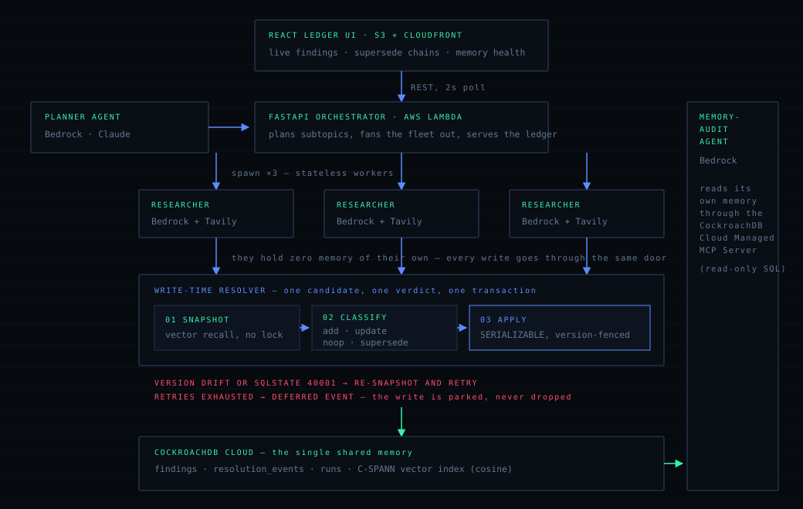
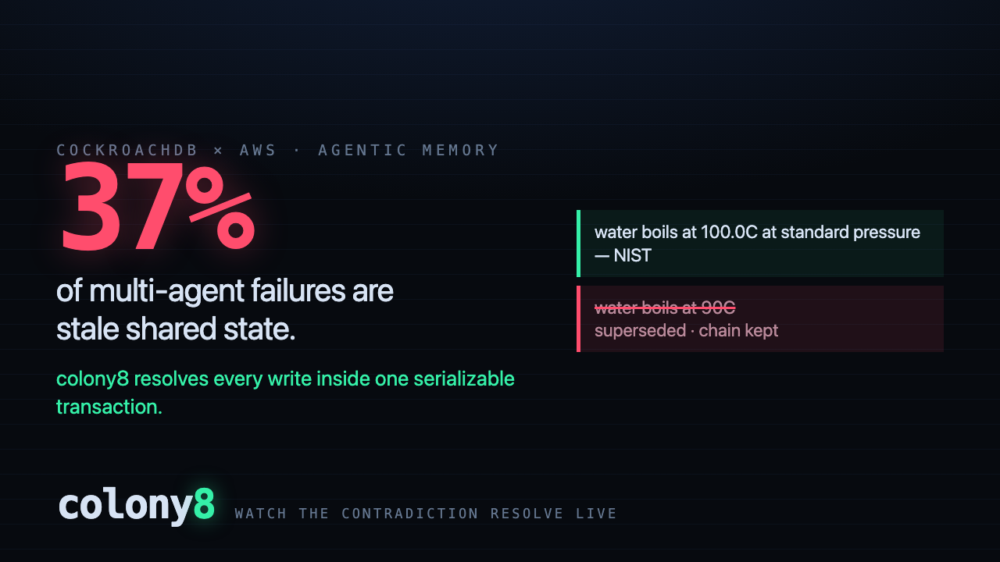

<div align="center">

# colony8

**Transactional shared memory for multi-agent fleets.**
Stateless agents. One memory. Every write resolved inside a serializable transaction.

[](#local-dev)
[](LICENSE)
[](#required-tools)
[](#required-tools)

**Live demo (replay):**
[supersede story](https://d70tlsfhdj221.cloudfront.net/?run=3afd8685-a815-4d81-b094-50455dda5ded) ·
[cross-session INJECT story](https://d70tlsfhdj221.cloudfront.net/?run=ddb06ee2-470f-4f07-b7bb-6f0d16d81728)

</div>

---

Multi-agent research fleets fail in a specific, avoidable way: agents act on stale
or divergent copies of shared state. Cemri et al.'s failure-mode study (summarized
by O'Reilly, 2025) attributes **37% of multi-agent system failures to inconsistent
shared state** — one agent writes, another reads a snapshot that's already wrong,
and both proceed as if nothing happened.

colony8 makes that class of bug impossible by construction. Every agent in the
fleet is stateless, and there is exactly one transactional memory — a CockroachDB
table guarded by a serializable write-time resolver — that all of them read and
write through. A finding is never silently overwritten; it is **superseded**, with
the full chain kept for audit.

## Architecture



## Required tools

Every tool below is load-bearing on the demo path — none is decorative.

| Tool | Role in colony8 | Where |
|---|---|---|
| CockroachDB Distributed Vector Indexing | semantic recall before every write, feeding candidate matches into the resolver | [`memory/db.py`](colony8/memory/db.py), [`memory/store.py`](colony8/memory/store.py) |
| CockroachDB Cloud Managed MCP Server | the memory-audit agent's *only* access path — read-only SQL over MCP | [`agents/audit.py`](colony8/agents/audit.py) |
| ccloud CLI | scripted, repeatable cluster + SQL user provisioning | [`scripts/provision_cloud.sh`](scripts/provision_cloud.sh) |
| Amazon Bedrock | planner / researcher / audit LLM via the Converse API (Nova Pro on the deployed demo; any Claude id drops in via `BEDROCK_MODEL_ID`) and Titan embeddings | [`ai/bedrock.py`](colony8/ai/bedrock.py) |
| AWS Lambda + API Gateway | stateless runtime for the API and ledger replay in production, fronted by an HTTP API | [`api/app.py`](colony8/api/app.py), [`Dockerfile`](Dockerfile) |
| Amazon S3 + CloudFront | static hosting and CDN for the ledger UI | [`scripts/deploy_frontend.sh`](scripts/deploy_frontend.sh) |

### The vector index is on the hot path — here's the proof

`recall()` runs before every single write. Two details make the index actually
serve it rather than sit there decoratively:

- the index opclass is **`vector_cosine_ops`**, matching the `<=>` operator the
  query orders by (an `l2` index silently falls back to a full scan);
- the `invalidated_at IS NULL` predicate is **not** in the ordering query — that
  predicate defeats the index too, so recall over-fetches and filters retired rows
  afterwards.

`EXPLAIN` on the exact query [`store.recall()`](colony8/memory/store.py) issues,
against 800 findings:

```
• top-k
└── • lookup join
    └── • vector search
          table: findings@findings_embedding_idx
          target count: 40
```

## How the resolver works

Every candidate finding goes through the same two-phase pipeline:

1. **Snapshot + classify (outside any transaction).** Vector recall against live
   findings for the run returns the nearest matches. If the best match is below the
   ADD threshold, the candidate is an unconditional `ADD`. Otherwise an LLM
   classifier compares the candidate against the matches and returns one of `ADD`,
   `UPDATE`, `NOOP`, or `SUPERSEDE`.
2. **Verify-and-apply (inside one SERIALIZABLE transaction).** The target row (if
   any) is re-read with `SELECT ... FOR UPDATE` and its version is checked against
   the snapshot. If nothing has changed, the decision is applied. If the version has
   drifted since the snapshot was taken, the whole cycle — snapshot, classify, apply
   — retries from the top. A `SQLSTATE 40001` serialization failure triggers a
   jittered retry as well.

If every retry attempt is exhausted without a clean apply, the candidate is recorded
as a `DEFERRED` resolution event rather than dropped or force-applied — the write is
never lost, just left for a human or a later pass.

`SUPERSEDE` never deletes a row: the losing finding gets `invalidated_at` and
`superseded_by` set, and stays queryable forever. The ledger UI renders both the live
findings and the full supersede chain behind each one.

**One honest gap:** two agents concurrently `ADD`ing brand-new, near-identical claims
can both land — there is no existing row yet to fence the write on. The duplicate
isn't lost; it's retired the moment a later candidate matches and supersedes it.

## Cross-session injection

Memory outlives a run. Before extracting from a source, each researcher recalls the
nearest live findings across **every** run — not just its own — and anything above a
relevance floor enters the extraction prompt as known context. The prompt tells the
extractor to skip what the colony already knows, so a later fleet never re-learns a
fact an earlier one established.

When claims from another session arrive this way, the researcher commits an `INJECT`
event to its ledger — context transfer between sessions is auditable, not implicit.
A second, unprefixed C-SPANN index (`findings_embedding_colony_idx`) serves this
colony-wide recall; the run-prefixed `findings_embedding_idx` serves the write path,
whose conflict resolution stays scoped to the writing run's ledger.

## Failure modes

The interesting question for a memory layer isn't the happy path — it's what happens
when something breaks mid-write. Every row below is exercised by the test suite, the
benchmark, or the demo.

| What goes wrong | What colony8 does |
|---|---|
| Two agents write the same fact at once | The loser's version check fails, it re-snapshots and re-classifies against the new truth |
| CockroachDB returns `SQLSTATE 40001` | Jittered retry, up to 5 attempts |
| All retries exhausted | `DEFERRED` resolution event — the candidate is parked, visible in the ledger, and never silently dropped |
| A researcher agent crashes | Its subtopic is marked failed; the run finishes as `completed_with_failures` with the other agents' writes intact |
| The orchestrator crashes | The run reaches a terminal `failed` status; if even that write fails it is logged rather than swallowed, so a run never hangs on `running` |
| Web search is down | That subtopic fails, the run continues |
| `CRDB_MCP_TOKEN` is unset | The memory audit is skipped; the run is unaffected |
| `EMBED_DIM` disagrees with an existing table | Startup fails loudly, instead of every insert failing one row at a time |
| The vector index is unavailable | Recall falls back to an exact scan — slower, identical results |
| The whole fleet dies | There is nothing to lose: agents hold zero state, and the ledger replays from CockroachDB |

**Observability** is the point of the design rather than a bolt-on: `resolution_events`
is a complete audit log of every decision the resolver ever made, with its reason, and
the memory-audit agent reads that back through the MCP server to report contradiction
rate and chain depth.

**Access control**: the deployed API runs with `ALLOW_LAUNCH=false`, so the public
surface is read-only replay; the MCP path the audit agent uses is read-only SQL; and
`provision_cloud.sh` creates a scoped SQL user rather than reusing a root credential.

## Quickstart

### Local dev

```bash
cp .env.example .env                  # backend config
cp frontend/.env.example frontend/.env  # UI needs VITE_API_BASE

./scripts/dev_db.sh &                 # throwaway single-node CockroachDB, localhost:26257
uv run pytest -q                      # 28 tests

uv run uvicorn colony8.api.app:app --reload   # backend, http://localhost:8000
cd frontend && npm install && npm run dev     # UI, http://localhost:5173
```

Set `DEMO_MODE=true` to serve web search from the canned [`demo/sources.json`](demo/sources.json)
corpus instead of live Tavily calls — this is what the recorded demo and video run
against. The source corpus is fixed, but LLM extraction may vary slightly between
runs, so replays are not guaranteed byte-identical.

### Environment variables

| Variable | Purpose | Default |
|---|---|---|
| `DATABASE_URL` | CockroachDB connection string (local or cloud) | local insecure node |
| `AWS_REGION` | region for Bedrock, Lambda, S3, CloudFront | `us-east-1` |
| `BEDROCK_MODEL_ID` | Bedrock Converse model id for planner/researcher/audit agents. Nova works on a fresh account; Anthropic Claude ids (e.g. `us.anthropic.claude-sonnet-4-6`) work once the account's Anthropic use-case form is approved | `us.amazon.nova-pro-v1:0` |
| `BEDROCK_EMBED_MODEL_ID` | Titan embedding model id used by the resolver | `amazon.titan-embed-text-v2:0` |
| `EMBED_DIM` | embedding vector width; the `findings.embedding` column is created at this width and startup fails loudly if an existing table disagrees | `1024` |
| `TAVILY_API_KEY` | web search; unused when `DEMO_MODE=true` | — |
| `DEMO_MODE` | `true` serves the canned demo corpus instead of live search | `false` |
| `CRDB_MCP_URL` | CockroachDB Cloud Managed MCP Server endpoint | cockroachlabs.cloud |
| `CRDB_MCP_TOKEN` | auth token for the MCP endpoint; unset skips the memory audit | — |
| `FLEET_SIZE` | number of parallel researcher agents per run; the connection pool is sized from it | `3` |
| `ALLOW_LAUNCH` | `false` serves replay only and 403s `POST /runs`. The deploy script sets this `false` — Lambda cannot host the background worker thread a live run needs | `true` |
| `VITE_API_BASE` | *(frontend)* backend origin the UI polls | `http://localhost:8000` |

AWS credentials are read from the standard AWS env/profile chain, not from `.env`.

### Deploy

```bash
./scripts/provision_cloud.sh          # one-time: CockroachDB Cloud cluster + SQL user
set -a; source .env; set +a
./scripts/deploy_backend.sh           # builds the Lambda image, prints the API Gateway URL
./scripts/deploy_frontend.sh https://<api-url>   # builds the UI, ships to S3+CloudFront
```

The deployed demo serves **replay** of a completed run. To populate it: run the
backend locally with `DATABASE_URL` pointed at the cloud cluster and `DEMO_MODE=true`,
complete a run against it, then share `<cloudfront-url>/?run=<run_id>`.

## Demo

[](demo/colony8-demo.mp4)

| | |
|---|---|
| **Video** | [`demo/colony8-demo.mp4`](demo/colony8-demo.mp4) — 2:39, [segment timestamps](demo/VIDEO_TIMESTAMPS.md); a context-anchor schematic tracks both sessions beside the footage from 0:09–1:20 |
| **Video (v2 cut)** | [`video/`](video/) — 2:24, an animated Remotion wrap of the earlier 2:27 cut; predates the cross-session INJECT beat ([timestamps](video/TIMESTAMPS.md)) |
| **Slide deck** | [`presentation/`](presentation/) — 14 slides, `npm run export` for PDF/PNG |
| **Live demo** | [supersede story](https://d70tlsfhdj221.cloudfront.net/?run=3afd8685-a815-4d81-b094-50455dda5ded) · [cross-session INJECT story](https://d70tlsfhdj221.cloudfront.net/?run=ddb06ee2-470f-4f07-b7bb-6f0d16d81728) — replay of runs populated against the hosted CockroachDB Cloud cluster |
| **Run it yourself** | [Quickstart](#local-dev) above; a full local run takes about a minute |

The demo asks a fleet about the thermal properties of water. A 2019 handbook claims
water boils at 90C; seconds later the NIST reference lands, the resolver classifies it
as a contradiction, and the earlier claim is superseded on screen — struck through,
chain intact. Then the backend is killed, restarted, and a NEW session asks a
different question: before its researchers touch a single source, session 1's claims
are injected into their context — a violet `INJECT` event lands on the new session's
ledger while its own memory is still empty. The known fact is skipped; only genuinely
new claims are written. Nothing ever lived in agent state, and nothing is re-learned.

## How it differs

Read against the designs these systems document publicly, rather than against a single
"typical" strawman — they differ from each other as much as from colony8:

| | colony8 | Zep / Graphiti | Mem0 | Letta / MemGPT | plain vector store |
|---|---|---|---|---|---|
| when conflicts resolve | at write time | at write time | at write time | when the agent edits its block | at read time, by the reader |
| concurrency control | SERIALIZABLE + `FOR UPDATE` version fence | deterministic edge resolution | none documented across writers | none across agents sharing a block | not applicable |
| history | supersede chains — retired, never deleted | validity windows closed, never deleted | in-place `UPDATE`/`DELETE` | block overwritten | everything kept, nothing marked stale |
| **event time vs write time** | **write time only** | **both — bi-temporal** | write time only | write time only | write time only |
| storage | SQL + vectors, one database, one transaction | temporal knowledge graph | vector + KV, optional graph | memory blocks | vectors |
| cross-session reuse | colony-wide recall, auditable `INJECT` events | shared graph | scoped by user/agent/run/app ids | shared blocks | whatever the app retrieves |

The row that matters most is the fourth: recording *when a claim was true* separately from
when it was written is the one capability here that colony8 lacks and Zep has, and it is
worth 6 points of accuracy in the benchmark below.

## Benchmarks

Measured on a laptop against a single-node in-memory CockroachDB; LLM and embedding
calls excluded (stub embeddings, rule classifier) — this measures the transactional
memory substrate. Reproduce with `uv run python scripts/bench.py`.

| operation | throughput | p50 | p95 |
|---|---|---|---|
| write, fast-path ADD (no conflict) | ~135 op/s | 7.6 ms | 8.3 ms |
| semantic recall, k=5 (~200 rows) | ~395 op/s | 2.3 ms | 3.7 ms |
| contended SUPERSEDE, 8 threads on one row | ~96 op/s | — | — |

### What write-time resolution actually buys — and what it costs

The table above measures the substrate. This one measures the *resolution algorithm*:
the same 246 contradicting writes over 200 facts, 8 concurrent writers, through the same
table, embedder and op classifier — changing only how and when a contradiction gets
resolved. Reproduce with `uv run python scripts/compare.py`.

> **No vendor code was run.** Mem0, Zep/Graphiti and Letta were not executed and these
> are not their scores. Each row is *this repository's reimplementation of the resolution
> algorithm that system documents publicly*, run against our store so the algorithm is the
> only variable. Running the real products would put their LLM in the loop — and the model
> moves the result more than the memory design does — as well as folding in their
> retrieval and extraction quality, which is not what this measures.

| resolution algorithm | final answer | stale rows in context | values lost | p50 write |
|---|---|---|---|---|
| **Zep/Graphiti-style** — bi-temporal validity windows | **94%** | 0.1 | 0 | ~15 ms |
| colony8 — write-time, version-fenced | 88% | 0.1 | **0** | ~10 ms |
| Mem0-style — LLM ADD/UPDATE/DELETE/NOOP in place | 88% | 0.1 | 222 | ~16 ms |
| Vector store — append-only, resolved by the reader | 88% | 1.1 | 0 | **~2 ms** |
| Letta/MemGPT-style — memory-block rewrite | 79% | 0.2 | 198 | ~16 ms |

**colony8 does not lead this table.** Zep/Graphiti's bi-temporal model beats it, for a
specific and fixable reason given below.

The 100 facts in [`scripts/compare_facts.json`](scripts/compare_facts.json) are split
across **nine contradiction shapes**, because a memory that only ever sees "a number was
wrong" is not being tested. Accuracy / stale rows in context / live rows per fact:

| shape | colony8 | Zep-style | Mem0-style | Letta-style | vector store |
|---|---|---|---|---|---|
| corrected (56) | 100% · 0.0 · 1.0 | 100% · 0.0 · 1.0 | 100% · 0.0 · 1.0 | 88% · 0.1 · 1.1 | 100% · 1.0 · 2.0 |
| deep chains (28) | 100% · 0.0 · 1.0 | 100% · 0.0 · 1.0 | 96% · 0.0 · 1.0 | 79% · 0.3 · 1.3 | 96% · 3.0 · 4.1 |
| re-asserted (20) | 100% · 0.0 · 1.0 | 100% · 0.0 · 1.0 | 100% · 0.0 · 1.0 | 95% · 0.0 · 1.1 | 100% · 0.0 · 2.2 |
| refinement (20) | 100% · 0.0 · 1.0 | 100% · 0.0 · 1.0 | 100% · 0.0 · 1.0 | 95% · 0.1 · 1.1 | 100% · 1.0 · 2.0 |
| retraction (16) | 100% · 0.0 · 1.0 | 100% · 0.0 · 1.0 | 100% · 0.0 · 1.0 | 81% · 0.2 · 1.2 | 100% · 0.9 · 2.0 |
| preference (16) | 100% · 0.0 · 1.0 | 100% · 0.0 · 1.0 | 100% · 0.0 · 1.0 | 88% · 0.1 · 1.1 | 100% · 1.0 · 2.0 |
| **out-of-order (12)** | **0%** | **100%** | **0%** | **0%** | **0%** |
| tie (12) | 0% | 0% | 0% | 0% | 0% |
| stable (20) — control | 100% | 100% | 100% | 100% | 100% |

*corrected* a value replaced once or twice · *deep* four to six successive revisions ·
*re-asserted* a second source repeats the value already held · *refinement* detail added
without contradicting · *retraction* a claim explicitly withdrawn · *preference* a stated
preference changes · *out-of-order* a claim about an **earlier** event arrives last ·
*tie* two sources disagree with no ordering · *stable* never contradicted.

Read honestly, that says five things:

- **Zep/Graphiti's bi-temporal model is the better design here, and the whole margin is
  one shape.** It records when a claim *was true* separately from when it was written, so
  a claim about an earlier event arriving late is filed as history instead of unseating
  the current value. colony8 scores 0% there; Zep-style scores 100%, and that single shape
  is the entire 94-vs-88 difference. Our `findings` table has no such column. See
  [Known gaps](#known-gaps) — the supersede chain is already the right shape to carry
  `valid_at` / `invalid_at`, so this is a schema addition rather than a redesign.
- **Where colony8 does hold up is history.** It and the append-only store lose nothing,
  while Mem0-style loses 222 values and Letta-style 198 — updating a memory in place
  leaves no trace of what it replaced, so a dropped write and a write that never happened
  look identical afterwards. Every superseded value here stays queryable behind its
  replacement.
- **The vector store defers the work rather than avoiding it.** It matches on the final
  answer at a fifth of the write cost, but hands the reader 1.1 stale rows per query — 4.1
  live rows per fact on deep chains against 1.0 — so every read pays to disambiguate what
  the write never settled.
- **Ties defeat every algorithm here (0% across the board).** Two sources disagreeing with
  nothing to order them need source authority, which none of these schemas records. Only
  ranking by confidence resolves them, and that is a reader-side heuristic, not a
  guarantee.
- **The bill for resolving at write time is ~5–10× the latency of appending blindly**, and
  Zep-style pays more still for its extra event-time read. Cheap writes are exactly what
  the vector store is selling.

The *stable* row is the control — with nothing to resolve, every algorithm is identical,
which is the check that the workload isn't manufacturing the result.

### Known gaps

The benchmark above is also the honest list of what this design does not do yet.

- **No event time, only ingestion time — the one place a competing design beats this
  one.** `findings` records `created_at`, when a claim was written, and nothing about when
  the claim was *true*. A claim about an earlier event arriving later therefore supersedes
  a newer one: 0% on the out-of-order shape, against 100% for the Zep/Graphiti-style arm,
  and that single shape is the entire gap between them. The fix is Graphiti's: a validity
  window per fact (`valid_at`, `invalid_at`) with a contradiction closing the window and
  the event time — not the write order — deciding what is current. The supersede chain is
  already the right shape to carry those two columns.
- **No source authority, so ties are resolved by arrival order.** When two sources
  disagree with nothing to order them, the resolver takes the later write — as does every
  other algorithm benchmarked, all of which score 0% on that shape. The resolver never
  looks at `confidence` when choosing a target; a tie-break on confidence or source
  authority would close this.
- **Concurrent creation of the same brand-new fact can duplicate.** With no existing row
  to fence against, two agents adding near-identical claims both land; the duplicate is
  retired the moment a later candidate matches it.
- **Retraction is a supersede, not a delete.** A withdrawn claim is stored as a live
  finding saying it was withdrawn, rather than the fact being marked absent. That reads
  correctly and keeps the audit chain, but it means "we no longer believe X" and "X" are
  both rows, and only their text distinguishes them.

**This is not a product benchmark.** Running Mem0, Zep or Letta head-to-head puts their
LLM in the loop, and the choice of model moves these scores more than the memory design
does — the number would measure the model. The rows above are the *architecture classes*
those systems document (read-time ranking; in-place update), implemented against this
same store so that the mechanism is the only variable.

Contention run (200 conflicting writes targeting a single fact): exactly **1 live
fact**, 184 retired with full audit chains, 155 conflict retries absorbed, **0 lost
writes**, 16 candidates parked as DEFERRED events (visible and retryable — never
silently dropped). Numbers vary run to run; the invariants (one live fact, zero lost
writes, zero silent drops) do not.

## What we learned

Seven things this project taught us that we did not know going in. Each one came from
something breaking or a measurement disagreeing with us.

**A vector index can be completely decorative and never say so.** An index created with
the default opclass is silently ignored by a query ordering on `<=>` — no error, no
warning, just a full scan. Adding an ordinary `WHERE` predicate to the ordering query
defeats it the same silent way. `EXPLAIN` is the only way to find out, which is why
`• vector search` appearing in the plan is quoted in this README rather than assumed.

**So correctness must never depend on the index.** Our first `recall()` over-fetched and
filtered retired rows in Python — fast, and wrong under contention, because a fact can
accumulate more retired ancestors than the window holds, hiding the live row and letting
a duplicate be added. The fix was an exact filtered fallback when the window comes back
saturated: the index is a speed-up, never the thing the invariant rests on.

**Resolving conflicts at write time does not make the answer more accurate.** We expected
it would. It doesn't — an append-only store with recency ranking scores exactly the same
88% on our benchmark. What write-time resolution actually buys is the *context around*
the answer: 0.1 stale rows per query instead of 1.1, one live row per fact instead of
four on long revision chains, and a supersede chain you can audit. We had to stop
claiming accuracy and start claiming purity.

**The most useful benchmark was the one we lost.** Implementing Zep/Graphiti's bi-temporal
algorithm properly — event time recorded separately from write time — put it six points
ahead of us, and every point came from a single shape: a claim about an *earlier* event
arriving late. Our schema has no place to record when a claim was true, so a stale arrival
supersedes a current fact. We only found this because we implemented the competing design
faithfully; our first attempt at their arm scored 0% too, and that was our bug, not theirs.

**Benchmark design is where the bias hides.** Three separate times a result looked good
until we found the reason it was wrong: racing the *creation* of facts measured a race
append-only designs never run; a classifier reading only the nearest neighbour made the
verdict depend on embedding hash collisions; confidence values that happened to be
monotonic made a fragile ranking heuristic look perfect. A control group of never-
contradicted facts — where every strategy must score identically — is the cheapest way to
catch a workload that is manufacturing its own conclusion.

**Cross-session memory changes the blast radius of test data.** Once recall spans every
run, a benchmark that writes a thousand synthetic facts is no longer isolated — those
facts get injected into the next real fleet's context. `scripts/compare.py` had to become
self-cleaning. Shared memory means test hygiene is a correctness concern, not tidiness.

**Context that crosses a session boundary needs an event, not just a lookup.** When one
fleet's claims enter another fleet's prompt, "it worked" is invisible — the second fleet
simply behaves better. Committing an `INJECT` row to the ledger turned an implicit
behaviour into something demonstrable, auditable, and testable.

## License

MIT — see [LICENSE](LICENSE). Third-party disclosures in [DISCLOSURES.md](DISCLOSURES.md).
